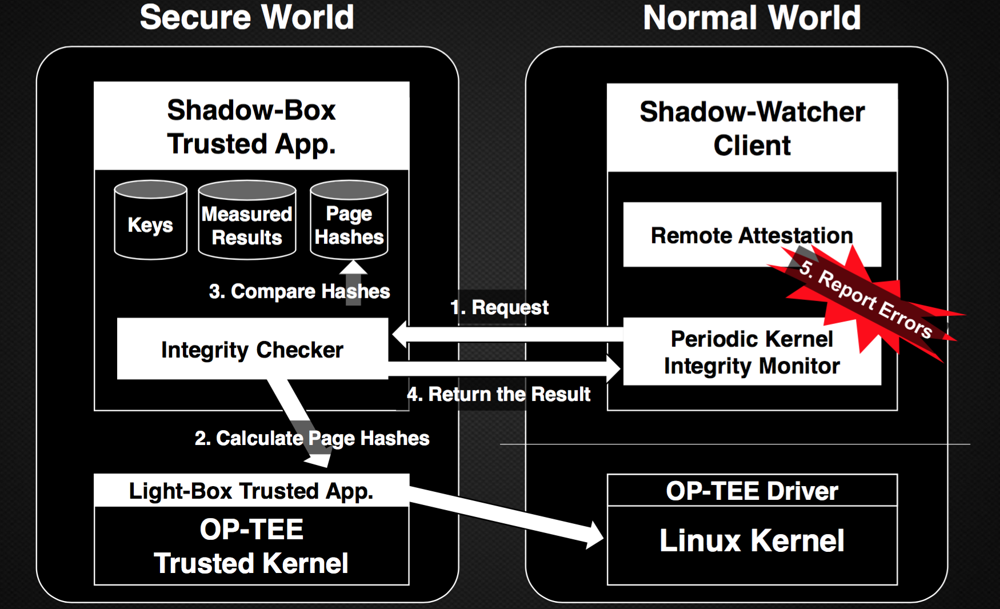
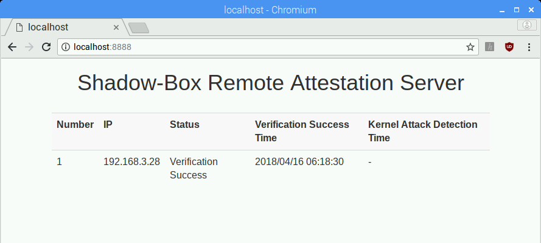
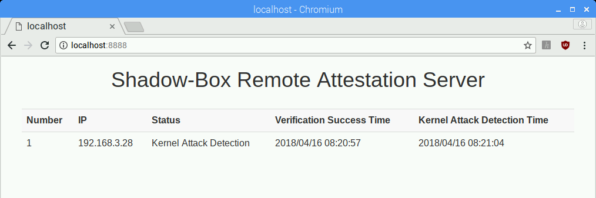

```bash      
 ███████╗██╗  ██╗ █████╗ ██████╗  ██████╗ ██╗    ██╗      ██████╗  ██████╗ ██╗  ██╗
 ██╔════╝██║  ██║██╔══██╗██╔══██╗██╔═══██╗██║    ██║      ██╔══██╗██╔═══██╗╚██╗██╔╝
 ███████╗███████║███████║██║  ██║██║   ██║██║ █╗ ██║█████╗██████╔╝██║   ██║ ╚███╔╝
 ╚════██║██╔══██║██╔══██║██║  ██║██║   ██║██║███╗██║╚════╝██╔══██╗██║   ██║ ██╔██╗
 ███████║██║  ██║██║  ██║██████╔╝╚██████╔╝╚███╔███╔╝      ██████╔╝╚██████╔╝██╔╝ ██╗
 ╚══════╝╚═╝  ╚═╝╚═╝  ╚═╝╚═════╝  ╚═════╝  ╚══╝╚══╝       ╚═════╝  ╚═════╝ ╚═╝  ╚═╝

                       ARM TrustZone-Based Kernel Protector
```

# 1. Notice
Shadow-box v2 (for ARM) is a next generation of Shadow-box v1 (for x86). If you want to know about Shadow-box for x86, please visit [Shadow-box for x86 project](https://github.com/kkamagui/shadow-box-for-x86).

We have been doing our best to publish our source code and will publish it soon.
Please give a star and watch our project!!!

# 1.1. Presentation
Shadow-box for ARM is a ARM TrustZone-based and practical kernel protector, and it was introduced at security conferences below.
 - [Black Hat Asia 2018](https://www.blackhat.com/asia-18/briefings.html#shadow-box-v2-the-practical-and-omnipotent-sandbox-for-arm): Shadow-box v2: The Practical and Omnipotent Sandbox for ARM

 You can watch the demo videos below.
 - [Demo](https://youtu.be/mhS3ujH6yyA): If you use the Integrity Measurement Architecture (IMA) feature with Shadow-box for ARM, then rootkits cannot neutralize the kernel and cannot work.

[](https://www.youtube.com/watch?v=mhS3ujH6yyA)

# 1.2. Contributions
We always welcome your contributions. Issue report, bug fix, new feature implementation, everything is alright. Feel free to send us.

# 1.3. License
Shadow-box v2 has dual license (MIT and GPL v2) and other parts follow their own license.

# 2. Introduction of Shadow-Box for ARM
Shadow-box for ARM, using virtualization technologies of x86 and ARM processor. Shadow-box for ARM inherits a novel architecture inspired by a shadow play from Shadow-box for x86, and we made Shadow-box for ARM from scratch. It utilizes OP-TEE (Open Platform Trusted Execution Environment) which follows GlobalPlatform TEE system architecture specification. Qualcomm and Samsung also follow the specification. Moreover, OP-TEE supports more than eleven manufacturers including Broadcom and NXP, therefore Shadow-box for ARM can be ported many ARM-based devices easily.

Shadow-box for ARM also utilizes integrity measurement architecture (IMA). IMA can verify signatures of executable files from the kernel. Therefore Shadow-box for ARM provides strict integrity of executable files. It has additional features such as hash-based kernel integrity monitor, workload-concerned monitoring, and remote attestation in comparison with Shadow-box for x86. 

# 2.1. Architecture of Shadow-Box for ARM
We explain how we resigned the Light-box and the Shadow-watcher. It is designed to support a lightweight and practical security monitoring framework using ARM TrustZone technology.

<center>  </center>

If you want to know more about Shadow-box, please see my presentation at [Black Hat Asia 2018](https://www.blackhat.com/asia-18/briefings.html#shadow-box-v2-the-practical-and-omnipotent-sandbox-for-arm).

# 3. How to Build Shadow-Box for ARM and Make Secure Pi with Raspberry Pi 3
## 3.1. Disclaimer
We made the prototype of Shadow-box for ARM with Raspberry Pi 3 board and named this "Secure Pi". Raspberry Pi board and Raspbian OS are the most famous embedded platform and spread widely. Although Raspberry Pi 3 doesn't have full security features of ARM TrustZone, there is no doubt that it is the best board for prototyping. If you want a fully-featured board, please choose another board such as Juno board, HiKey board, ATSAMA5D2-XULT board, and i.MX7Dual SabreSD Board.

In this section, we extract and summarize the contents of OP-TEE document to prepare the build environment below. If you want to see the original document of OP-TEE, please visit [https://github.com/OP-TEE/build](https://github.com/OP-TEE/build).

## 3.2. Download Raspbian OS and flash it to the microSD
First of all, You need to download Raspbian OS from the Raspberry Pi site. You can download the latest version of Raspbian OS from [https://www.raspberrypi.org/downloads/raspbian/](https://www.raspberrypi.org/downloads/raspbian/). We used 2017-12-01 version for our prototype and you can get it from [http://downloads.raspberrypi.org/raspbian/images/raspbian-2017-12-01/2017-11-29-raspbian-stretch.zip](http://downloads.raspberrypi.org/raspbian/images/raspbian-2017-12-01/2017-11-29-raspbian-stretch.zip).

After downloading it, insert the microSD card into your PC and flash Raspbian OS to it with commands below.

```bash
$ unzip <Raspbian OS file name>
$ sudo dd bs=4M if=<File name.img> of=/dev/sd<Character of microSD disk> conv=fsync
```

To test the microSD, insert microSD to Raspberry Pi 3 and boot with it.

## 3.3. Prepare Build Environment and Get Source Code of Shadow-Box for ARM
To build Shadow-box for ARM and Secure Pi, we should prepare for the build environment. We assume that you use Ubuntu-based distro (Ubuntu 16.04 is recommended). To install packages for building Shadow-box for ARM, type commands below.

```bash
$ sudo apt-get install android-tools-adb android-tools-fastboot autoconf \
	automake bc bison build-essential cscope curl device-tree-compiler flex \
	ftp-upload gdisk iasl libattr1-dev libc6:i386 libcap-dev libfdt-dev \
	libftdi-dev libglib2.0-dev libhidapi-dev libncurses5-dev \
	libpixman-1-dev libssl-dev libstdc++6:i386 libtool libz1:i386 make \
	mtools netcat python-crypto python-serial python-wand unzip uuid-dev \
	xdg-utils xterm xz-utils zlib1g-dev repo
```

To get the source code of Shadow-box, type commands below.

```bash
$ mkdir -p $HOME/shadow-box
$ cd $HOME/shadow-box
$ git config --global user.name "USER NAME"
$ git config --global user.email "USER EMAIL"
$ repo init -u https://github.com/kkamagui/manifest.git -m rpi3.xml -b secure-pi
$ repo sync
```

## 3.4. Get Toolchains and Build OP-TEE with Shadow-Box for ARM
To build OP-TEE and Shadow-box for ARM, you need toolchains and you can get toolchains with commands below.

```bash
$ cd build
$ make toolchains
```

## 3.4.1. Build Linux Kernel without the Sample Rootkit
After installing toolchains, you build OP-TEE and Shadow-box with commands in build directory below.

```bash
$ make
```

## 3.4.2. Build Linux Kernel with the Sample Rootkit to Check Protection Features of Shadow-Box for ARM
Linux kernel for Raspbian OS has the sample rootkit, Adore-ng, to test protection features and it is disabled by default. If you want to check the protection features of Shadow-box for ARM, you need to add "CONFIG\_ADORE\_NG=y" to rpi3.conf file as follows. After the feature tests, you should remove adore-ng.ko file from /lib/modules directory.

```bash
$ cd $HOME/shadow-box/build
$ vi kconfig/rpi3.conf
... omitted ...
CONFIG_CRYPTO=y
CONFIG_ARMV8_DEPRECATED=y

# Add the sample rootkit
CONFIG_ADORE_NG=y
```

## 3.5. Copy OP-TEE with Shadow-Box for ARM to Raspbian OS
### 3.5.1. Copy OP-TEE OS with Shadow-Box for ARM and New Linux Kernel to Raspbian OS
You insert microSD again and remount boot/rootfs directory in microSD. Then type commands below to inflate OP-TEE OS with Shadow-box and new Linux kernel to boot directory in microSD.

```bash
$ cd <Your mount point of microSD, ex. "/media/user/">
$ gunzip -cd $HOME/shadow-box/gen_rootfs/filesystem.cpio.gz | sudo cpio -iudmv "boot/*"
$ sudo cp -r $HOME/shadow-box/module_output/lib/* rootfs/lib/

# Copy Linux kernel header package to home directory if you need it
$ sudo cp $HOME/shadow-box/linux-headers-*.deb rootfs/home/pi
```

### 3.5.2. Copy Libraries and Shadow-Box Client to Raspbian OS
You continue to copy OP-TEE libraries and Shadow-box client to the rootfs directory in microSD.

```bash
# Copy all libraries and utils
$ sudo cp -r $HOME/shadow-box/optee_client/out/export/* rootfs/

# Copy Shadow-box client
$ sudo cp $HOME/shadow-box/optee_examples/shadow_box_client/host/shadow_box_client rootfs/bin/
```

## 3.6. From Shadow-Box for ARM to Secure Pi
From this section, you should use Raspberry Pi 3 instead of your build machine.

### 3.6.1. Boot Shadow-Box-Powered Raspbian OS
You insert microSD to Raspberry Pi 3 and boot with it. Then you can see a slightly different boot screen. If you boot your Pi for the first time, you should type commands below to expand root fs.

```bash
$ sudo raspi-config --expand-rootfs
$ sudo reboot
```

### 3.6.2. Install IMA-EVM-utils to build Secure Pi
Raspbian OS doesn't have the IMA-EVM-utils package. Therefore, we should build it from the source code and type commands below for it.

```bash
# Install packages to build the tool
$ sudo apt-get install autoconf libtool libssl-dev libattr1-dev libkeyutils-dev asciidoc

# Clone the repository and build it
$ git clone https://git.code.sf.net/p/linux-ima/ima-evm-utils
$ ./autogen.sh
$ ./configure
$ make

# Install
$ sudo make install
$ sudo ldconfig
```

### 3.6.3. Generate Keys for IMA and Sign local files
To create the private key for IMA, you make x509\_evm.genkey file fist. The contents of the file are below.

```bash
# Begining of x509_evm.genkey file
[ req ]
default_bits = 1024
distinguished_name = req_distinguished_name
prompt = no
string_mask = utf8only
x509_extensions = myexts
[ req_distinguished_name ]
O = Shadow-Box
CN = Shadow-Box IMA key
emailAddress = kkamagui@gmail.com
[ myexts ]
basicConstraints=critical,CA:FALSE
keyUsage=digitalSignature
subjectKeyIdentifier=hash
authorityKeyIdentifier=keyid
```

After making the genkey file, you can create the key pair of private key and public key, and you copy them to the system directory (/etc/ima).
```bash
$ mkdir IMA
$ cd IMA
$ openssl req -new -nodes -utf8 -sha1 -days 36500 -batch -x509 -config x509_evm.genkey -outform DER \
-out x509_evm.der -keyout privkey_evm.pem
$ openssl rsa -pubout -in privkey_evm.pem -out pubkey_evm.pem

# Copy the key to /etc/ima
$ sudo mkdir /etc/ima
$ sudo cp x509_evm.der /etc/ima
```

```bash
$ sudo vi /etc/ima/ima_policy

# Begining of ima_policy file
dont_appraise fsmagic=0x9fa0
dont_appraise fsmagic=0x62656572
dont_appraise fsmagic=0x64626720
dont_appraise fsmagic=0x01021994
dont_appraise fsmagic=0x858458f6
dont_appraise fsmagic=0x1cd1
dont_appraise fsmagic=0x42494e4d
dont_appraise fsmagic=0x73636673
dont_appraise fsmagic=0xf97cff8c
dont_appraise fsmagic=0x27e0eb
dont_appraise fsmagic=0x6e736673
appraise func=FILE_MMAP mask=MAY_EXEC appraise_type=imasig
appraise func=MODULE_CHECK appraise_type=imasig
appraise func=FIRMWARE_CHECK appraise_type=imasig
appraise func=KEXEC_KERNEL_CHECK appraise_type=imasig
appraise func=KEXEC_INITRAMFS_CHECK appraise_type=imasig
```

Finally, we can sign local files with our privkey\_evm.pem file. The sign script file and the batch sign script file are below.

```bash
# Begining of ima_sign.sh

#!/bin/bash
evmctl ima_sign --key privkey_evm.pem "$1"
```

```bash
# Begining of batch_ima_sign.sh

#!/bin/bash
find /bin \( -fstype rootfs -o -fstype ext4 \) -type f -uid 0 -exec ./ima_sign.sh {} > /dev/null \;
find /boot \( -fstype rootfs -o -fstype ext4 \) -type f -uid 0 -exec ./ima_sign.sh {} > /dev/null \;
find /dev \( -fstype rootfs -o -fstype ext4 \) -type f -uid 0 -exec ./ima_sign.sh {} > /dev/null \;
find /etc \( -fstype rootfs -o -fstype ext4 \) -type f -uid 0 -exec ./ima_sign.sh {} > /dev/null \;
find /home \( -fstype rootfs -o -fstype ext4 \) -type f -uid 0 -exec ./ima_sign.sh {} > /dev/null \;
find /lib \( -fstype rootfs -o -fstype ext4 \) -type f -uid 0 -exec ./ima_sign.sh {} > /dev/null \;
find /lib64 \( -fstype rootfs -o -fstype ext4 \) -type f -uid 0 -exec ./ima_sign.sh {} > /dev/null \;
find /media \( -fstype rootfs -o -fstype ext4 \) -type f -uid 0 -exec ./ima_sign.sh {} > /dev/null \;
find /mnt \( -fstype rootfs -o -fstype ext4 \) -type f -uid 0 -exec ./ima_sign.sh {} > /dev/null \;
find /opt \( -fstype rootfs -o -fstype ext4 \) -type f -uid 0 -exec ./ima_sign.sh {} > /dev/null \;
find /root \( -fstype rootfs -o -fstype ext4 \) -type f -uid 0 -exec ./ima_sign.sh {} > /dev/null \;
find /run \( -fstype rootfs -o -fstype ext4 \) -type f -uid 0 -exec ./ima_sign.sh {} > /dev/null \;
find /sbin \( -fstype rootfs -o -fstype ext4 \) -type f -uid 0 -exec ./ima_sign.sh {} > /dev/null \;
find /srv \( -fstype rootfs -o -fstype ext4 \) -type f -uid 0 -exec ./ima_sign.sh {} > /dev/null \;
find /usr \( -fstype rootfs -o -fstype ext4 \) -type f -uid 0 -exec ./ima_sign.sh {} > /dev/null \;
find /var \( -fstype rootfs -o -fstype ext4 \) -type f -uid 0 -exec ./ima_sign.sh {} > /dev/null \;
find /home \( -fstype rootfs -o -fstype ext4 \) -type f -uid 0 -exec ./ima_sign.sh {} > /dev/null \;
```

After creating ima\_sign.sh and batch\_ima\_sign.sh in IMA directory, you sign local files with commands below.

```bash
# Add an executable bit to shell scripts
$ chmod +x batch_ima_sign.sh
$ chmod +x ima_sign.sh

$ sudo ./batch_ima_sign.sh
... Waiting for a long time ...
```

### 3.6.4. Activate IMA and Start the Executable File Protection
Now we are ready to activate IMA, the executable file protection feature.

First, set the "iversion" flag in /etc/fstab.
```bash
# Begining of /etc/fstab file
proc            /proc           proc    defaults          0       0
PARTUUID=49783f5b-01  /boot           vfat    defaults,iversion          0       2
PARTUUID=49783f5b-02  /               ext4    defaults,noatime,iversion  0       1
# a swapfile is not a swap partition, no line here
#   use  dphys-swapfile swap[on|off]  for that
```

Second, create an IMA service file.
```bash
$ sudo vi /etc/init.d/ima-sig

# Begining of /etc/init.d/ima-sig file
#!/bin/sh
### BEGIN INIT INFO
# Provides: ima-sig
# Required-Start: $local_fs
# Required-Stop: $local_fs
# Default-Start: 2 3 4 5
# Default-Stop: 0 1 6
# Short-Description: Start ima-sig
### END INIT INFO

start()
{
	echo "start ima-sig"
	ima_id=`keyctl newring _ima @u`
	cat /etc/ima/x509_evm.der | keyctl padd asymmetric '' $ima_id
	IMA_POLICY=/sys/kernel/security/ima/policy
	LSM_POLICY=/etc/ima/ima_policy
	if [ -e $LSM_POLICY ] ; then
		grep -v "^#" $LSM_POLICY > $IMA_POLICY
	fi
}

stop()
{
	echo "stop ima-sig"
}

case "$1" in
	start) start
		;;
	stop) stop
		;;
	*)
		echo “Usage: /etc/init.d/ima-sig {start|stop}”
		exit 1
		;;
esac

```

Third, register it to the system with commands below.
```bash
$ sudo chmod 755 /etc/init.d/ima-sig
$ sudo update-rc.d ima-sig defaults
```

### 3.6.5. Activate Shadow-Box for ARM and Start Secure Pi!
Shadow-box for ARM needs the address\_table.dat file to protect Linux kernel area. For that, you should know the physical address range of Linux kernel and can get it with commands below in your build machine.

```bash
# These commands should be executed in your build machine
$ cd $HOME/shadow-box/linux
$ grep -e "\_[s|e]text$" System.map
ffffff8008082000 T _stext
ffffff8008956000 T _etext
```

The address\_table.dat consists of an address count, a start physical address and a size. The code area of Linux kernel is from 0xffffff8008082000 to 0xffffff8008956000 and Raspbian kernel maps 0x00 to 0xffffff8008000000, therefore the contents of address\_table.dat can be below. This information is also applied to OP-TEE OS. Check the [https://github.com/kkamagui/optee_os/commit/6a18e9f6ff3072e0537f547b0a4eb8170b4d024d](https://github.com/kkamagui/optee_os/commit/6a18e9f6ff3072e0537f547b0a4eb8170b4d024d) patch (Unlike address\_table.dat, we added some buffer to OP-TEE OS). You should create address\_table.dat file in your Raspberry Pi 3.

```bash
# These commands should be executed in you Raspberry Pi 3
$ cd $HOME/
# Clone the Github repository
$ git clone https://github.com/kkamagui/shadow-box-for-arm.git
$ cd shadow-box-for-arm/shadow_box_client

$ vi address_table.dat
# Begining of address_table.dat
1
82000 8d4000
```

After creating address\_table.dat, you need to produce hash\_table.dat with commands below in shadow-box-for-arm/shadow\_box\_client directory.

```bash
$ sudo shadow_box_client -g

... Waiting for a while ...
```

Shadow-box for ARM uses hash\_table.dat to protect kernel and it should be encrypted by the symmetric key. The key and encrypt/decrypt function is implemented in shadow-box-for-arm/remote\_attestation\_server/crypt.py and [shadow-box in OP-TEE file](https://github.com/kkamagui/optee_os/blob/6a18e9f6ff3072e0537f547b0a4eb8170b4d024d/core/arch/arm/pta/shadow_box.c#L311). You can encrypt the file with commands below.

```bash
$ cd $HOME/shadow-box-for-arm/remote_attestation_server/
$ python crypt.py ../shadow_box_client/hash_table.dat ../shadow_box_client/hash_table.dat.enc
```

Finally, you can start Shadow-box for ARM with commands below.

```bash
$ cd $HOME/shadow-box-for-arm/shadow_box_client
# Send the encrypted hash table file to Shadow-box for ARM
$ sudo shadow_box_client -h hash_table.dat.enc

# Start kernel protection
$ sudo shadow_box_client -s
Cpu load is 10.62%
Cpu load is 9.38%
... omitted ...
```

### 3.6.6. Check Your Secure Pi Remotely
Secure Pi has a remote attestation feature and you can activate it with commands below in your Raspberry Pi. After the commands are executed, your Secure Pi opens 8885 port for the remote attestation server.

```bash
$ cd $HOME/shadow-box-for-arm/shadow_box_client -l
Sever port 8885 start

Wait for incoming connections...
```

Remote attestation server in the shadow-box-for-arm repository has several files below and you can copy all files to your build machine or Raspberry Pi for the remote attestation.

```bash
$ cd $HOME/shadow-box-for-arm/remote_attestation_server/
$ ls
crypt.py                   <= An encrypt and decrypt library for Shadow-box for ARM
get_shadow_box_status.py   <= A command line tool for the remote attestation feature
index.html.template        <= An web page templete for the remote attestation server
server.py                  <= A simple web server for the web interface
```

The IP address of your Raspberry Pi should be described in get\_shadow\_box\_satus.py file below.

```bash
$ vi get_shadow_box_status.py
... omitted ...
HOST = "YOUR_RASPBERRY_PI_IP_ADDRESS_HERE"
PORT = 8885
... omitted ...

```

After that, you can check the status of your Raspberry Pi with the command below.
```bash
$ python get_shadow_box_status.py
Try to connect... Success
    [*] Nonce: 2759721970
Request Kernel Status to Shadow-box... Complete
    [*] Status: Verification Success
    [*] Verification Success Time: 2018 04 16 06:12:25
```

If you want to check the status through the web interface, execute the command below and connect to "localhost:8888" with your browser.
```bash
$ python server.py
Serving HTTP on 0.0.0 port 8888 ...
Try to connect... Success
    [*] Nonce: 263246213
Request Kernel Status to Shadow-box... Complete
    [*] Status: Verification Success
    [*] Verification Success Time: 2018 04 16 06:22:30

```

<center>  </center>

# 4. How to Test Secure Pi
Secure Pi has two protection feature, the executable file protection (IMA) and the Linux kernel protection (Shadow-box). If you added the sample rootkit at Section 3.3.2, you can test all features of Secure Pi. If you didn't add it, you only can test the executable file protection feature.

# 4.1. Test the Executable File Protection (IMA) Feature
To test the executable file protection feature, build a client of the sample rootkit with commands below. If you build and execute it, the executable file is not executed although you have the root privilege. Therefore, if you and the attacker download the executable files intentionally or unintentionally, Secure Pi can prevent them. Please check the demo videos below at Section 1.1.


```bash
# These commands should be executed in your Raspberry Pi
$ cd $HOME/shadow-box-for-ARM/sample_rootkit/adore-ng_client
$ make

# Execute a unauthorized executable file
$ sudo ./ava
$ Segmentation fault                 <= Error occurs although you are root!

# Check the detailed error message in kernel
$ dmesg | grep "/ava"
[11116.110201] audit: type=1800 audit(1523864866.837:20): pid=5493 uid=1000 auid=1000 ses=1 op="appraise_data" cause="missing-hash" comm="ava" name="/home/pi/shadow-box-for-arm/sample_rootkit/adore-ng_client/ava" dev="mmcblk0p2" ino=258223 res=0
```

# 4.2. Test the Linux Kernel Protection Feature
To test the Linux kernel protection feature, load the sample rootkit, adore-ng.ko with commands below. You added signatures to all local files at Section 3.5.3, therefore you can load the sample rootkit. In a normal case, the executable file protection feature can prevent unauthorized kernel modules.

```bash
# Load the sample rootkit
$ sudo modprobe adore-ng
$ dmesg
[13111.149744]  ▄▄▄      ▓█████▄  ▒█████   ██▀███  ▓█████        ███▄    █   ▄████
[13111.165719]  ▒████▄    ▒██▀ ██▌▒██▒  ██▒▓██ ▒ ██▒▓█   ▀        ██ ▀█   █  ██▒ ▀█▒
[13111.180966]  ▒██  ▀█▄  ░██   █▌▒██░  ██▒▓██ ░▄█ ▒▒███    ███  ▓██  ▀█ ██▒▒██░▄▄▄░
[13111.198809]  ░██▄▄▄▄██ ░▓█▄   ▌▒██   ██░▒██▀▀█▄  ▒▓█  ▄  ▒▒▒  ▓██▒  ▐▌██▒░▓█  ██▓
[13111.215264]   ▓█   ▓██▒░▒████▓ ░ ████▓▒░░██▓ ▒██▒░▒████▒      ▒██░   ▓██░░▒▓███▀▒
[13111.232214]    ▒▒   ▓▒█░ ▒▒▓  ▒ ░ ▒░▒░▒░ ░ ▒▓ ░▒▓░░░ ▒░ ░      ░ ▒░   ▒ ▒  ░▒   ▒
[13111.247330]      ▒   ▒▒ ░ ░ ▒  ▒   ░ ▒ ▒░   ░▒ ░ ▒░ ░ ░  ░      ░ ░░   ░ ▒░  ░   ░
[13111.261738] 	   ░   ▒    ░ ░  ░ ░ ░ ░ ▒    ░░   ░    ░            ░   ░ ░ ░ ░   ░
[13111.272880] 	         ░  ░   ░        ░ ░     ░        ░  ░               ░       ░
[13111.283187] 			            ░
[13111.291360] Adore Function Ptr: ffffff800808d218
[13111.312804] Adore Patch Complete
[13111.316326] Adore Function Ptr: ffffff800808d218
[13111.329418] Adore Patch Complete
[13111.332899] patch vfs     : ffffff800826edb8 --> ffffff8000cf90a0
[13111.339384] Adore Function Ptr: ffffff800808d218
[13111.353018] Adore Patch Complete
[13111.356362] patch vfs     : ffffff8008292980 --> ffffff8000cf9118
[13111.363228] Adore Function Ptr: ffffff800808d218
[13111.377446] Adore Patch Complete
[13111.380816] patch proc_net: ffffff800866a340 --> ffffff8000cf9d60
[13111.387313] Adore Function Ptr: ffffff800808d218
[13111.392234] Adore Patch Complete
[13111.395992] Adore-ng v2.0 is now activated!
```

Although the sample rootkit is executed successfully in the normal world, the Shadow-box for ARM in the secure world can detect the modification of Linux kernel and report it to the remote attestation server. You can check the status of your Raspberry Pi remotely as follows.

```bash
$ python get_shadow_box_status.py
Try to connect... Success
    [*] Nonce: 4280018068
Request Kernel Status to Shadow-box... Complete
    [*] Status: Kernel Attack Detection
    [*] Verification Success Time: 2018 04 16 08:20:57
    [*] Attack Detection Time: 2018 04 16 08:21:04
```

If you want to check the status through the web interface, execute the command below and connect to "http://localhost:8888" with your browser.

<center>  </center>

# Future Work:
 - [ ] Upgrade cryptographic algorithm in Shadow-box
 - [ ] Remove the hard-coded key
 - [ ] Make a service for Shadow-box for ARM like IMA-sig service
